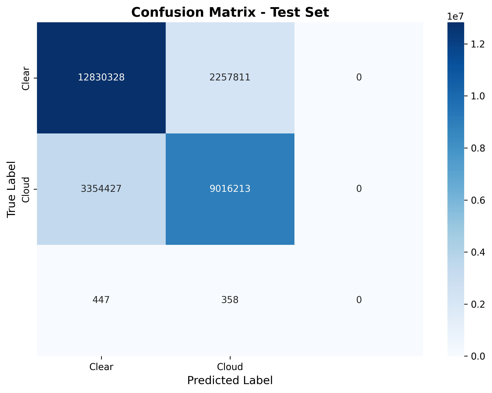
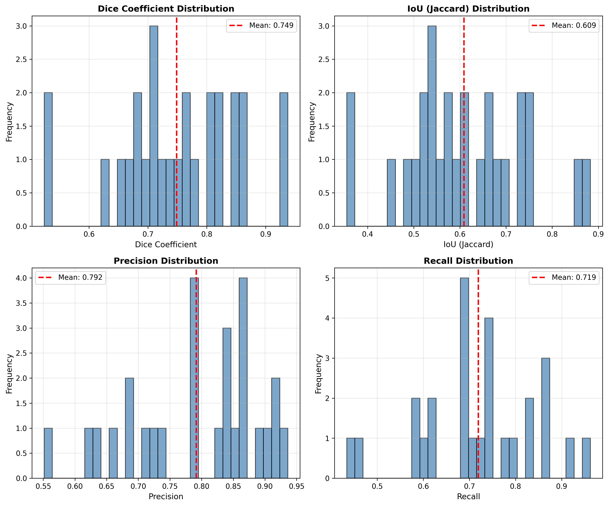
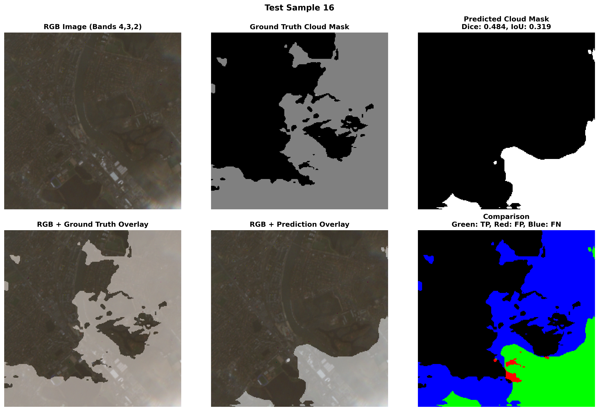

# Cloud Segmentation from Sentinel-2 Satellite Imagery

A deep learning-based system for automatic cloud detection in Sentinel-2 multispectral satellite imagery using U-Net with ResNet34 encoder.

## 🎯 Overview

This project implements an end-to-end pipeline for cloud segmentation in satellite imagery, from data preprocessing through model training and evaluation. The system achieves a Dice coefficient of 0.749 on unseen test data.

## 📊 Key Results

| Metric | Score |
|--------|-------|
| **Dice Coefficient** | 0.7488 ± 0.1007 |
| **IoU (Jaccard)** | 0.6088 ± 0.1286 |
| **Accuracy** | 78.71% |
| **Precision** | 79.16% |
| **Recall** | 71.95% |
| **F1-Score** | 74.88% |

## 🏗️ Architecture

- **Model**: U-Net with ResNet34 encoder
- **Input**: 6-channel Sentinel-2 imagery (Bands: B02, B03, B04, B08, B11, B12)
- **Output**: Binary cloud mask (256×256 pixels)
- **Parameters**: 24.4M
- **Framework**: PyTorch with segmentation-models-pytorch

## 📁 Project Structure

```
cloud-segmentation/
├── preprocessing/
│   └── preprocess_sentinel2_v2_fixed.py    # Sentinel-2 data preprocessing
├── data_preparation/
│   └── generate_patches_fixed.py           # Training patch generation
├── src/
│   ├── dataset_fixed.py                    # PyTorch dataset loader
│   ├── model.py                            # U-Net model definition
│   ├── train.py                            # Training script
│   ├── evaluate_fixed.py                   # Evaluation script
│   └── visualize.py                        # Prediction visualization
├── jobs/
│   ├── train_clean.pbs                     # GPU training job
│   ├── evaluate_model.pbs                  # Evaluation job
│   └── visualize_predictions.pbs           # Visualization job
└── results/
    ├── confusion_matrix.png
    ├── metrics_distribution.png
    └── example_predictions/
```

## 🚀 Quick Start

### Prerequisites

- Python 3.10+
- CUDA 11.8+ (for GPU training)
- Sentinel-2 Level-2A data

### Installation

```bash
# Clone repository
git clone https://github.com/YOUR_USERNAME/cloud-segmentation.git
cd cloud-segmentation

# Create virtual environment
python -m venv venv
source venv/bin/activate  # On Windows: venv\Scripts\activate

# Install dependencies
pip install -r requirements.txt
```

### Usage

See [USAGE.md](USAGE.md) for detailed instructions.

**Quick Pipeline:**

```bash
# 1. Preprocess Sentinel-2 data
python preprocessing/preprocess_sentinel2_v2_fixed.py \
    --input /path/to/sentinel2/data \
    --output /path/to/processed

# 2. Generate training patches
python data_preparation/generate_patches_fixed.py \
    --input /path/to/processed \
    --output /path/to/dataset

# 3. Train model
python src/train.py \
    --data_dir /path/to/dataset \
    --output_dir /path/to/models \
    --use_gpu

# 4. Evaluate
python src/evaluate_fixed.py \
    --model_path /path/to/checkpoint_best.pth \
    --data_dir /path/to/dataset \
    --output_dir /path/to/results \
    --use_gpu
```

## 📊 Dataset

- **Source**: Sentinel-2 Level-2A MSI imagery
- **Scenes**: 5 tiles
- **Spectral Bands**: 6 (B02, B03, B04, B08, B11, B12)
- **Resolution**: 10m (all bands resampled)
- **Training Patches**: 1,952 (256×256 pixels)
- **Validation Patches**: 418
- **Test Patches**: 419
- **Cloud Coverage**: 5-95% (mean: 42.6%)

## 🎓 Model Details

### Architecture
- **Encoder**: ResNet34 (pretrained on ImageNet)
- **Decoder**: U-Net with skip connections
- **Loss Function**: Combined Dice + Binary Cross-Entropy
- **Optimizer**: Adam (lr=0.001, weight_decay=1e-4)
- **Scheduler**: Cosine Annealing
- **Training Time**: ~6 minutes on Tesla V100

### Data Augmentation
- Horizontal & Vertical Flips
- Random 90° Rotations
- Shift-Scale-Rotate
- Random Brightness/Contrast
- Gaussian Noise

### Training
- **Epochs**: 67 (early stopping patience: 15)
- **Batch Size**: 16
- **Best Validation Dice**: 0.787 (epoch 51)
- **Hardware**: NVIDIA Tesla V100 GPU

## 📈 Results

### Confusion Matrix


### Metrics Distribution


### Example Predictions


**Legend:**
- **Green**: True Positives (correctly detected clouds)
- **Red**: False Positives (incorrectly detected clouds)
- **Blue**: False Negatives (missed clouds)

## 🔧 System Requirements

### For Training
- **GPU**: NVIDIA GPU with 8GB+ VRAM
- **RAM**: 32GB+
- **Storage**: 50GB+ free space
- **OS**: Linux (tested on Ubuntu 24.04)

### For Inference
- **GPU**: NVIDIA GPU with 4GB+ VRAM
- **RAM**: 16GB+

## 📚 Citation

If you use this code in your research, please cite:

```bibtex
@misc{cloud-segmentation-2026,
  author = {Sri Satya Jayanth Voruganti},
  title = {Cloud Segmentation from Sentinel-2 Satellite Imagery},
  year = {2026},
  publisher = {GitHub},
  url = {https://github.com/SriVoruganti/cloud-segmentation}
}
```

## 🙏 Acknowledgments

- Sentinel-2 data courtesy of ESA/Copernicus
- U-Net architecture: [Ronneberger et al., 2015](https://arxiv.org/abs/1505.04597)
- ResNet: [He et al., 2015](https://arxiv.org/abs/1512.03385)
- Segmentation Models PyTorch: [qubvel](https://github.com/qubvel/segmentation_models.pytorch)
- Training performed on UNSW Katana HPC cluster

## 🤝 Contributing

Contributions are welcome! Please feel free to submit a Pull Request.

## 📧 Contact

For questions or collaboration:
- **Author**: Sri Voruganti
- **Email**: satyajayanth.voruganti@gmail.com
- **Institution**: UNSW Sydney

## 🔮 Future Work

- [ ] Expand dataset to 20+ scenes for improved generalization
- [ ] Implement deeper encoder architectures (ResNet50, EfficientNet)
- [ ] Add explainable AI (XAI) visualizations (Grad-CAM, attention maps)
- [ ] Ensemble methods for improved accuracy
- [ ] Real-time inference optimization
- [ ] Multi-class segmentation (cloud types)

---

**⭐ If you find this project useful, please consider giving it a star!**
